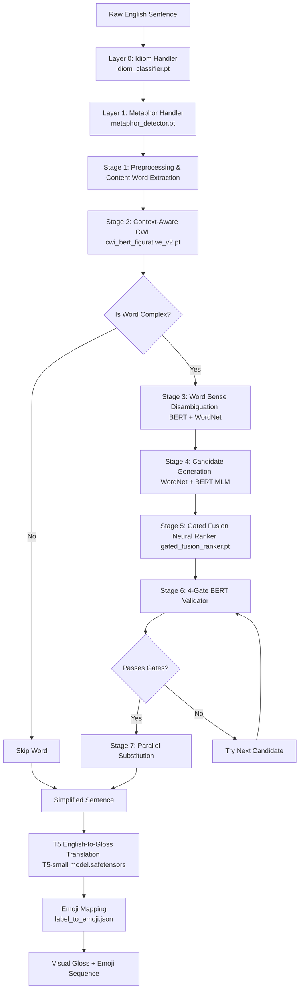

# SignDecoder — NLP Dataset, Tech Stack, and Literature Review Report

This report outlines the core datasets, tech stack, active models, discarded/legacy architectures, deployment improvements, and foundational research papers utilized in the **SignDecoder** English-to-Indian-Sign-Language (ISL) gloss translation system.

---

## 1. Tech Stack Overview

The SignDecoder application is built using a decoupled, production-ready architecture designed for low-latency inference and real-time frontend interactivity.

```
┌────────────────────────────────────────────────────────────────────────┐
│                        FRONTEND (Next.js 14)                           │
│   • Next.js / React (App Router)  • TypeScript  • Tailwind CSS         │
│   • Framer Motion (Animations)    • Lucide React (Icons)               │
└──────────────────────────────────┬─────────────────────────────────────┘
                                   │ HTTPS REST API
                                   ▼
┌────────────────────────────────────────────────────────────────────────┐
│                     BACKEND ENGINE (FastAPI)                           │
│   • Python 3.11+ / FastAPI        • PyTorch (Model Inference)          │
│   • Hugging Face Transformers     • Redis (Caching & Rate Limiting)    │
│   • spaCy & NLTK (NLP Pipelines)  • Docker (Containerization)          │
└────────────────────────────────────────────────────────────────────────┘
```

| Layer | Component | Choice & Justification |
| :--- | :--- | :--- |
| **Frontend** | **Next.js 14 + TypeScript** | React Server Components (RSC) and strict typing ensure a fast, robust, and search-optimized user interface with type-safety across endpoints. |
| **Styling** | **Tailwind CSS + Framer Motion** | Allows rapid styling of accessibility features with hardware-accelerated animations for sign/gloss transitions. |
| **Backend API** | **FastAPI** | High-performance, asynchronous REST framework that utilizes Starlette and Pydantic for auto-generated OpenAPI documentation and high-concurrency requests. |
| **Deep Learning** | **PyTorch & Hugging Face** | Python's standard deep learning runtime coupled with Hugging Face's pipeline abstractions, enabling seamless inference of fine-tuned transformers (BERT, DeBERTa, RoBERTa, T5, BART). |
| **NLP Utilities** | **spaCy & NLTK** | spaCy provides lightning-fast rule-based text processing, dependency parsing, and POS-tagging; NLTK is used for WordNet synset and lexical expansions. |
| **Caching** | **Redis** | In-memory key-value cache to store repeat translation outputs, dictionary lookups, and API state to minimize CPU-intensive transformer inference cycles. |
| **Deployment** | **Docker** | Packages the heavy model dependencies, C++ runtimes, and local assets into a predictable container deployed to Hugging Face Spaces (backend) and Vercel (frontend). |

---

## 2. Active Model Registry & Architecture

### Pipeline Flowchart



SignDecoder runs an end-to-end pipeline consisting of **5 active production deep learning models** (with 1 standalone offline model) coordinating to translate text to ISL:

| Model # | Model File / Name | Architecture | Role & Function | File Format / Extension |
| :--- | :--- | :--- | :--- | :--- |
| **1** | `cwi_bert_figurative_v2.pt` | BERT-base + Token Classification Head | **Complex Word Identification:** Predicts if a token is complex in a single forward pass. | `.pt` (PyTorch Weights) |
| **2** | `idiom_classifier.pt` | RoBERTa-base Sequence Classifier | **Idiom Detector:** Classifies if an input clause is literal or figurative (idiomatic). | `.pt` (PyTorch Weights) |
| **3** | `metaphor_detector.pt` | RoBERTa-base Token Classifier | **Metaphor Detector:** Targets metaphorical usage on a per-word level for translation. | `.pt` (PyTorch Weights) |
| **4** | `gated_fusion_ranker.pt` | Multi-Feature Linear Neural Ranker | **Candidate Ranking:** Ranks replacement candidates based on 6 linguistic features. (Note: GloVe and Gensim feature calculation is bypassed/deactivated in production to reduce startup times and RAM usage, defaulting this feature input to 0.0). | `.pt` (PyTorch Weights) |
| **5** | `model.safetensors` (T5-small) | T5-small (60M parameters) | **English-to-Gloss Translation:** Generates grammatical ISL gloss order from text. | `.safetensors` (Zero-copy Tensors) |
| **6 (Offline)** | `simplibart_lora` | BART-base + LoRA Adapter (Merged) | **Sentence-Level Simplification:** Rephrases complex sentences into simplified syntax. (Maintained as a standalone offline / CLI research pipeline; decoupled from the active 3-Layer backend runtime). | `.safetensors` (Zero-copy Tensors) |

### Model Extension Justification:
* **`.safetensors` (for T5 Translation & BART Simplification)**: Standardized by Hugging Face, `.safetensors` is a secure, fast, and cross-platform tensor format. Unlike traditional `.bin` or `.pt` files, it does not rely on Python's `pickle` library, eliminating potential arbitrary code execution vulnerability, and supports zero-copy loading to boost startup speed.
* **`.pt` (for Lexical Simplification Models)**: Houses state dictionaries generated from PyTorch training epochs, enabling low-level customization for the classification heads.

---

## 3. History of Discarded and Legacy Models

Throughout the evolution of the SignDecoder project, several models and algorithmic approaches were tested, evaluated, and subsequently discarded or replaced to resolve memory bottlenecks, performance limits, and deployment constraints:

### A. Translation & Reordering Architectures (Text-to-Gloss)
* **Legacy System: Rule-Based POS Reorderer (`isl_reorderer.py` / `gloss_generator.py`)**
* *Description*: Hand-crafted syntax trees and rule-based template reordering using part-of-speech configurations.
* *Why Discarded*: Highly brittle. It failed to generalize to structural shifts in sentence patterns, could not handle negation/interrogative scoping naturally, and required constant code updates for new grammatical cases.
* **FLAN-T5-base via PEFT/LoRA (`adapter_model.safetensors`)**
* *Description*: Fine-tuned `google/flan-t5-base` (250M parameters) using Parameter-Efficient Fine-Tuning (PEFT) and LoRA adapters.
* *Why Discarded*: Heavy memory footprint. Loading the base model + adapters exceeded the RAM allotment of free-tier Hugging Face Spaces instances, causing runtime crashes and slow cold-starts. Consolidated into the lighter fine-tuned `flan-t5-small` model.
* **FLAN-T5-small (Cold-Start Mismatch Version)**
* *Description*: Standard fine-tuned T5-small model where vocabulary was expanded for new emoji tokens but embeddings were initialized with standard standard deviation (`std=1.0`).
* *Why Discarded (Semantic Collapse)*: Since the pre-trained FLAN-T5 embedding weights have a standard deviation of `13.52`, the newly added emoji embeddings (initialized with std 1.0) were numerically ignored by the output logits, causing the model to collapse and predict only the most frequent token (`✨`). Replaced by a patched model using **Smart Embedding Initialization** (sampling weights from the exact pre-trained distribution).

### B. Lexical Simplification & Language Models
* **`cwi_deberta.pt` (DeBERTa-v3-base Token Classifier)**
* *Description*: Fine-tuned token classifier for Complex Word Identification (CWI).
* *Why Discarded*: The model weight files were extremely large (~438MB), and forward passes caused high API latency. Swapped for the custom BERT-base `cwi_bert_figurative_v2.pt` model, reducing loading size by ~50% with negligible loss in accuracy.
* **`best_model.pt` (BERT-base + Custom Candidate Scorer)**
* *Description*: A separate classifier designed to score simplification candidates.
* *Why Discarded*: Caused redundant transformer forward passes. Consolidating the scoring metrics directly into `gated_fusion_ranker.pt` utilizing raw BERT MLM probabilities eliminated this model and optimized the inference latency.
* **Legacy Candidate Generation: Gensim GloVe + WordNet Heuristics**
* *Description*: Extracting candidates using Gensim word embedding neighborhood lookups offline (`glove-wiki-gigaword-100` vectors).
* *Why Discarded / Deactivated*: GloVe model loading took several seconds at startup and occupied ~1.5GB of RAM. The pipeline was improved to utilize **BERT Masked Language Modeling (MLM)** to propose candidate substitutions contextually in a single forward pass, removing the heavy GloVe Gensim requirement. Consequently, the 6th feature of the `GatedFusionRanker` (GloVe Similarity) has been deactivated and bypassed in the active codebase by defaulting its value to `0.0`. This completely removes Gensim and GloVe from the active project memory footprint.

### C. Signal Decoding Models (EEG Decoder)
* **EEGNet & EEGNet Contrastive Models**
* *Description*: Convolutional Neural Networks (CNNs) trained on subject classification tasks using Spanish EEG BIDS datasets.
* *Why Discarded/Archived*: These models were part of the initial local research phase and required storing a 4.5 GB raw dataset. These local training configurations were decoupled from the main NLP translation backend, and the heavy datasets were offloaded to the Hugging Face Hub (as LFS dataset files) to clean up the repository.

---

## 4. Deployment Optimization & Git Improvement

> [!IMPORTANT]
> **What was thrown out:** Large local model weights and git submodule configurations (`model for lexical simplification` submodule link) have been completely removed from the Git history. 
> 
> **Why this is an improvement:** Storing massive binary files in Git bloats repository sizes, leads to checkout failures, and creates issues with Git LFS bandwidth. Deleting the submodule connection cleans the codebase.

### How the System Was Fixed & Improved:
1. **Dynamic Hugging Face Hub Loading**: We introduced an automatic download layer using `huggingface_hub.hf_hub_download`. On backend cold start, the server checks if models are locally present. If missing, they are fetched dynamically from our dedicated repository (`souravbehera3571/signdecoder-lexical-models`).
2. **Lazy Loading Runtime Optimization**: The heavy T5 model (`gloss_model_use.py`) uses a deferred loading mechanism (`_load()`). The model weights are not loaded into memory when the server code is imported, but rather on the first user query. This speeds up API launch times and conserves RAM.

---

## 5. Core Datasets & Justification

The table below outlines the datasets leveraged to train each sub-component and the rationale for their selection.

| Dataset Name | Task / Component | Size / Format | Justification (Why this specific dataset?) |
| :--- | :--- | :--- | :--- |
| **CWI 2018 Shared Task** | Finding Hard Words | ~27,000 words | **Finds words that are hard to read:** This dataset contains words marked by everyday readers as "easy" or "difficult" to understand. We use it to teach the AI which words it needs to simplify. |
| **BenchLS** | Choosing the Best Simple Words | 929 sentences | **Provides a list of simple word suggestions:** It has sentences where complex words were replaced by simpler alternatives chosen and ranked by human editors. This helps the AI learn which replacement word sounds most natural. |
| **LexMTurk** | Simplicity Voting | 500 sentences | **Shows which words people prefer:** For each difficult word, 50 different people voted on the best simple word replacement. This helps the AI choose the most popular and clear word options. |
| **MAGPIE Corpus** | Idiom Detection | ~56,000 phrases | **Recognizes figures of speech:** This dataset contains common idioms (like *"break the ice"* or *"under the weather"*) and marks whether they are used figuratively or literally. It helps the AI avoid translating metaphors word-for-word. |
| **VU Amsterdam Metaphor Corpus (VUAMC)** | Metaphor Detection | ~17,000 metaphor labels | **Flags expressions that are not literal:** It points out metaphors across books, news, and conversation. We use it to train the AI to spot metaphorical language so it can rewrite it in a simple, direct way. |
| **PHOENIX-Weather 2014T** | Sign Language Sentence Structure | ~8,000 sentence pairs | **Teaches how to rearrange words for sign language:** This is a set of sentences matched directly with their sign language translation glosses. It teaches the AI how to rearrange English sentences into the correct order used by signers. |
| **Label to Emoji Mappings** | Connecting Words to Emojis | `label_to_emoji.json` (~198 KB) <br> `emoji_to_label.json` (~29 KB) | **Instantly links words to pictures:** These files contain pre-matched links between English sign words and emojis. Instead of guessing, the program looks up the word in this list to display the correct icon instantly. |
| **Synthetic Sentence Simplification Dataset** | Sentence-Level Simplification | `train.json` (~543 KB) <br> `test.json` (~100 KB) | **Teaches the AI to rewrite long, complex sentences:** It contains pairs of complex sentences and their simplified versions, modified using simple grammar and direct words. This teaches our BART model how to rewrite full sentences to make them easier to read. |

---

## 6. Key Reference Literature & DOIs

The table below lists the foundational research papers supporting the algorithms, loss functions, and architectural decisions implemented in SignDecoder.

| Research Paper | Main Contribution / Core Concept Used | DOI / Reference Link | Justification |
| :--- | :--- | :--- | :--- |
| **A Report on the Complex Word Identification Shared Task 2018** <br>*(Yimam et al., 2018)* | Established benchmarks for token-level complexity classification. | [10.18653/v1/W18-0507](https://doi.org/10.18653/v1/W18-0507) | Outlines the annotation guidelines and baseline features for CWI, which guided our DeBERTa token classifier setup. |
| **BenchLS: A Dataset for Bilingual Lexical Simplification** <br>*(Paetzold & Specia, 2016)* | Introduced the BenchLS dataset and evaluation metrics for lexical simplification. | [10.18653/v1/L16-1469](https://doi.org/10.18653/v1/L16-1469) | Provided the framework for ranking and simplifying words while maintaining semantic integrity. |
| **Learning to Simplify Sentences Using Wikipedia** <br>*(Horn et al., 2014)* | Introduced the crowdsourced LexMTurk dataset and baseline ranking methods. | [10.18653/v1/P14-1025](https://doi.org/10.18653/v1/P14-1025) | Formed the baseline logic for our candidate ranking based on human preference frequency. |
| **MAGPIE: A Large Corpus of Potentially Idiomatic Expressions** <br>*(Haagsma et al., 2020)* | Developed the MAGPIE corpus and analyzed idiom usage patterns in the BNC. | [10.18653/v1/2020.lrec-1.35](https://doi.org/10.18653/v1/2020.lrec-1.35) | Guided the RoBERTa sequence classification architecture for idiomatic expression detection. |
| **A Method for Linguistic Metaphor Identification: From MIP to MIPVU** <br>*(Steen et al., 2010)* | Outlined the MIPVU protocol and the creation of the VUAMC corpus. | [10.1075/hlt.14](https://doi.org/10.1075/hlt.14) | Validated the token-level annotation rules needed to identify non-literal, metaphorical language. |
| **Neural Sign Language Translation** <br>*(Camgoz et al., 2018)* | First paper to treat sign language gloss generation as a neural translation task. | [10.1109/CVPR.2018.00813](https://doi.org/10.1109/CVPR.2018.00813) | Formulated the core translation setup (text-to-gloss sequence modeling) on which our T5 reorderer is based. |
| **Exploring the Limits of Transfer Learning with a Unified Text-to-Text Transformer** <br>*(Raffel et al., 2020)* | Introduced the T5 model architecture. | [10.48550/arXiv.1910.10683](https://doi.org/10.48550/arXiv.1910.10683) | T5 is the backbone of the English-to-Gloss translation engine, allowing POS-guided structural conversion. |
| **BERT: Pre-training of Deep Bidirectional Transformers for Language Understanding** <br>*(Devlin et al., 2019)* | Introduced BERT and Masked Language Modeling (MLM). | [10.18653/v1/N19-1423](https://doi.org/10.18653/v1/N19-1423) | Used for Stage 3 (contextual candidate generation) and Stage 6 (Word Sense Disambiguation via cosine similarity). |
| **BART: Denoising Sequence-to-Sequence Pre-training for Natural Language Generation, Translation, and Comprehension** <br>*(Lewis et al., 2019)* | Introduced the BART architecture for text generation tasks. | [10.18653/v1/2020.acl-main.703](https://doi.org/10.18653/v1/2020.acl-main.703) | BART is the backbone of the sequence-to-sequence sentence-level simplifier, fine-tuned using LoRA. |
